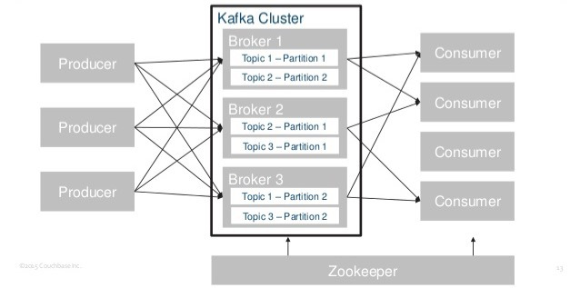

# apache Kafka 카프카, 데이터 플랫폼의 최강자

## 카프카란 무엇인가

카프카는 링크드인에서 처음 출발한 기술로서, 링크드인 사이트가 급속도로 성장하면서 발생하는 여러 이슈들을 해결하기 위해 탄생.

시스템 복잡도가 늘고 파이프라인이 파편화되면서 개발이 지연되고 데이터를 신뢰할 수 없는 상황에 이르자, 모든 시스템으로 데이터를 전송할 수 있고 실시간 처리도 가능하며 확장 용이한 시스템을 만들기로 함.

1. 프로듀서와 컨슈머의 분리
2. 메세징 시스템과 같이 영구 메시지 데이터를 여러 컨슈머에게 허용
3. 높은 처리량을 위한 메시지 최적화
4. 데이터가 증가함에 따라 스케일 아웃 가능해야함.

## 카프카 주요 용어

producer : 메세지 생산(발행)자.

consumer : 메세지 소비자

consumer group : consumer 들끼리 메세지를 나눠서 가져간다.offset 을 공유하여 중복으로 가져가지 않는다.

broker : 카프카 서버를 가리킴

zookeeper : 카프카 서버 (+클러스터) 상태를 관리하고

cluster : 브로커들의 묶음

topic : 메세지 종류

partitions : topic 이 나눠지는 단위

Log : 1개의 메세지

offset : 파티션 내에서 각 메시지가 가지는 unique id

## 카프카 동작 방식과 원리

카프카는 기본적으로 메시징 서버로 동작

카프카에 토픽이라는 각각의 메시지 저장소에 데이터를 저장하면, 가져가는측이 원하는 토픽에서 데이터를 가져가게 되어있습니다.

펍/섭 모델: 비동기 메시지 전송 방식으로 , 발신자의 메시지에는 수신자가 정해져 있지 않은 상태로 발행 합니다. 구독을 신청한 수신자만이 정해진 메시지를 받을 수 있습니다.

프로듀서가 메시지를 컨슈머에게 직접 전달하는게 아니라 중간의 메시징 시스템에 전달합니다.

카프카는 메시지 교환 전달의 신뢰성 관리를 프로듀서와 컨슈머 쪽으로 넘기고, 부하가 많이 걸리는 교환기 기능 역시 컨슈머가 만들 수 있게 함으로써 메시징 시스템 내에서의 작업량을 줄이고 이렇게 절얄한 작업량을 메시징 전달 성능에 집중시켜 고성능 메시징 시스템을 만들어냈음.

## 카프카 특징

1. 프로듀서와 컨슈머 분리
   카프카는 메시징 전송 방식 중 메시지를 보내는 역할과 받는 역할이 완벽하게 분리된 펍/섭 방식을 적용

2. 멀티 프로듀서, 멀티 컨슈머
   카프카는 하나의 토픽에 여러 프로듀서 또는 컨슈머들이 접근 가능한 구조로 되었습니다.

3. 디스크에 메시지 저장
   카프카가 기존의 메시징 시스템과 가장 다른 특징 중 하나는 바로 디스크에 메시지를 저장하고 유지하는 것.
   디스크에 저장되어 있기 때문에 메시지 손실없이 작업가능

4. 확장성
   하나의 카프카 클러스터는 3대의 브로커로 시작해 수십대의 브로커로 확장 가능.

5. 높은성능
   고성능을 유지하기 위해 카프카는 내부적으로 분산처리, 배치처리 등 다양한 기법 사용.

## 카프카 관리를 위한 주키퍼

분산애플리케이션을 사용하게 되면, 분산 애플리케이션 관리를 위한 안정적인 코디네이션 애플리케이션이 추가로 필요하게 됩니다. 분산 애플리케이션을 개발하면서 동시에 코디네이션도 개발하다보면 추가 리소스가 많이 들게 되므로 이미 안정적인 코디네이션 서비스로 검증된 주키퍼를 많이 사용하고 있습니다.

카프카는 분산 애플리케이션의 한 종류로서 주키퍼를 코디네이션 로직으로 이용

결국 주키퍼는 분산 애플리케이션을 위한 코디네이션 시스텝입니다.

주키퍼는 그림과 같이 서버여러대를 클로스터로 구성하고, 분산애플리케이션들이 각각 클라이언트가 되어 주키퍼 서버들과 커넥션을 맺은 후

상태 정보를 주고 받게 됩니다. 상태정보는 주키퍼의 지노드라고 하는 곳에 키밸류 형태로 저장하고 지노드에 저장된 것을 이용하여 분산애플리케이션들이 서로 주고 받음.

## 카프카 디자인의 특징

1.  분사시스템
    단일 시스템이 아니기 때문에 더 높은 성능을 얻을 수 있고, 분산 시스템 중 하나의 서버 또는 노드 등이 장애가 발생하면 다른 서버 또는 노드가 대신 처리하고, 시스템 확장이 용이하다. 카프카도 비슷하게 클러스터 내의 브로커 수를 늘려서 클러스터의 최대 처리량을 높이는 성능을 얻을 수 있습니다.

2.  페이지 캐시
    OS 는 물리적 메모리에 애플리케이션이 사용하는 부분을 할당하고 남은 잔여 메모리 일부를 페이지 캐시로 유지해 OS의 전체적인 성능 향상을 높이게 됩니다. 이렇게 잔여 메모리를 이용해 디스크에 읽고 쓰기를 하지 않고 페이지 캐시를 통해 읽고 쓰는 방식을 사용하면 처리속도가 매우 빠름. https://en.wikipedia.org/wiki/Page_cache

     

     
페이지캐시

     페이지 캐시는 리눅스(VFS 계층) 에서는 디스크 접근을 최소화 하여 파일 I/O성능을 향상시키기 위해 사용되는 메모리 영역입니다.

         한 번 읽은 파일의 내용을 이 페이지 캐시 영역에 저장하고, 같은 파일의 접근이 일어나면 디스크에서 읽어오는 것이 아니라 페이지 캐시에서 읽어오게 됩니다.

     

3) 배치 전송 처리
   작은 I/O가 빈번하게 일어나면 이 또한 속도를 저하시키는 원인이 될 수 있습니다. 따라서 카프카에서는 작은 I/O들을 묶어서 처리할 수 있도록 배치 작업을 처리 합니다.

## 카프카 데이터 모델

토픽과 파티션이라는 데이터 모델 역할이 카프카를 고성능, 고가용성 애플리케이션으로 발전하게 함

#### `토픽`

카프카 클러스터는 토픽이라 불리는 곳에 데이터를 저장합니다.

예를 들어 동영상과 관련된 프로듀서들은 동영상 토픽으로 메세지를 보내고, 뉴스 담당자가 뉴스 관련 토픽만 보고싶다면 카프카의 뉴스 토픽에 컨슈머를 연결하여 뉴스만 가져올 수 있습니다.

#### `파티션`

카프카에서 파티션이란 토픽을 분할한 것입니다.

메시지 처리량을 늘리려면 파티션 수를 늘려줌으로써 효과를 볼 수 있습니다.

무조건 파티션 수를 늘려야할까?
토픽 파티션 수가 증가하면 빠른 전송이 가능하다는 사실을 알게 됐습니다. 그렇다면 토픽의 파티션수를 많이 늘려주는 것이 무조건 좋을까요 ?

1. 파일 핸들러의 낭비
   각 파티션은 브로커의 디렉토리와 매핑되고, 저장되는 데이터마다 2개의 파일이 있습니다. 카프카에서는 모든 디렉토리의 파일들에 대해 파일 핸들을 열게되고, 파티션수가 많을 수록 파일 핸들 수 역시 많아지게 되어 리소스 낭비하게 됨

2. 장애 복구 시간 증가
   각 파티션마다 리플리케이션이 동작하게되고, 하나는 파티션의 리더이고 나머지는 파티션의 팔로워가 됩니다. 만약 브로커가 다운되게 되면 해당 브로커에 리더가 있는 파티션은 일시적으로 사용할 수 없게 되므로 카프카는 리더를 팔로워 중 하나로 이동시켜 클라 요청을 처리할 수 있게 합니다. 이와 같은 장애 처리는 컨트롤러라고 지정된 브로커가 수행합니다. 컨트롤러는 카프카 클러스터 내 하나만 존재하고 만약 컨트롤러 역할을 수행하는 브로커가 다운되면 살아있는 브로커 중 하나가 자동으로 컨트롤러 역할을 하게 됩니다.

#### `오프셋과 메세지 순서`

카프카에서는 오프셋을 이용하여 메세지의 순서를 보장합니다.

## 리플리케이션

카프카의 레플리케이션은 토픽 자체를 리플리케이션 하는것이 아니라, 토픽을 이루는 각각의 `파티션`을 리플리케이션 하는 것입니다.

팩터(factor): 카프카의 기본값은 1로 되어있으며 복제본을 만드는 갯수를 말합니다.

리플리케이션을 완벽하게 보장하기 위해서는 브로커에서 비 활성화된 토픽의 상태를 체크 하는 등의 작업이 이루어져 리소스 사용량이 증가하게 됩니다. 그래서 모든 토픽에 리플리케이션을 적용하기 보다는 중요도에 따라서 팩터를 조정하는것이 운영에 효율적입니다.

#### `리더와 팔로워 관리`

`리더`는 모든 데이터의 읽기 쓰기에 대한 요청에 응답하면서 데이터를 저장해나가고,`팔로워`는 리더를 주기적으로 보면서 자신에게 없는 데이터를 리더러부터 주기적으로 가져오는 방법으로 `리플리케이션을 유지`합니다.

하지만 리더로부터 데이터를 가져오지 못하는경우가 발생할 경우 큰 문제가 생길 수 있는데, ISR(In sync Replica)라는 개념을 도입하여 해당 현상을 방지합니다.

`ISR`: 현재 리플리케이션 되고있는 레플리카 그룹. 여기에 속해있는 구성원만이 리더 자격을 가질 수 있습니다.

(123p)

#### `모든 브로커가 다운된다면?`

1. 마지막 리더가 살아나길 기다린다.(메세지 손실은 없지만 어려운조건). 이 경우 모두 다운된 상태이지만 살아난다면 메세지 손실 없이 프로듀스의 요청을 처리하면서 서비스 제공이 가능

2. ISR에서는 추방되었지만 먼저 살아나면 자동으로 리더가 된다(메세지 손실). 가장 마지막 리더가 갖고 있었던 메세지가 손실 될 수 있다.

카프카 0.11.0.0버젼 이하에서는 기본값으로 2번 방안을 선택해 일부 데이터 손실이 발생하더라도 서비스 측면에서 빠르게 서비스를 ㅔㅈ공 할 수 있게 해주지만, 그 이후 버젼부터는 기본값을 1번으로 선택하여 데이터 손실 없이 마지막 리더가 살아나길 기다린 후 서비스가 되게 대처.

## 프로듀서

파티션은 키 값이 입력되어 있지 않을 경우 라운드로빈 방식으로 균등하게 분배 됩니다.

**주요옵션**
bootstrap.servers: 카프카 클러스터는 클러스터 마스터라는 개념이없기 때문에, 클러스터 내 모든 서버(브로커)가 클라이언트의 요청을 받을 수 있습니다. 해당 옵션은 카프카 클러스터에 처음 연결하기 위한 호스트와 포트 정보로 구성된 리스트 정보를 나타냅니다.

**acks**:
프로듀서가 카프카의 토픽의 리더에게 메세지를 보낸 후 요청을 완료하기 전 ack(승인)수입니다. 해당 옵션의 수가 작으면 성능이 좋지만, 메세지 손실 가능성이 있고, 반대로 수가 크면 선능이 좋지않지만 메세지 손실 가능성도 줄어듦

**acks=0**
프로듀서는 서버로부터 어떠한 ack도 기다리지 않고, 데이터를 받았는지 보장하지 않음.

**acks=1**
리더는 데이터를 기록하지만, 모든 팔로워는 확인하지 않습니다. 일부 데이터 손실 발생할 수 있음

**acks=all or -1**
리더는 ISR의 팔로워로부터 데이터에 대한 ack을 기다립니다. 하나의 팔로워가 있는 한 데이터는 손실 되지 않고, 데이터 무손실에 대해 보장.

**buffer.memory**
프로듀서가 카프카 서버로 데이터를 보내기 위해 잠시 대기할 수 있는 전테 메모리 바이트입니다.

**compression.type**
프로듀서가 데이터를 압축해서 보낼 수 이쓴데, 어떤 타입으로 압축할지를 정할 수 있습니다.

**retries**:
일시적인 데이터 오류로 인해 전송에 실패한 데이터를 다시 보내는 횟수

**batch.size**
프로듀서는 같은 파티션으롭 ㅗ내는 여러 데이터를 함께 배치로 보내려고 시도. 이때 배치 크기 바이트를 조정가능. 정의된 크기보다 큰 데이터는 배치를 시도하지 않음. 배치를 보내기 전에 클라가 장애 발생하면 배치 내에 있던 메세지는 전달 되지 않습니다. 그래서 만약 고가용성이 필요한 메세지의 경우라면 배치사이즈를 주지 않는다.

**linger.ms**
배치 형태의 메세지를 보내기 전에 추가적인 메세지들을 위해 기다리는 시간을 조정. 배치 사이즈에 도달하지 못한 상황에서 이 시간에 도달했을때 메세지를 전송.

**max.request.size**
프로듀서가 보낼 수 있는 최대 바이트 사이즈 입니다. 기본은 1MB.

#### `전송 속도는 느리지만 메세지 손실이 없어야 하는 경우`

acks = all + min.insync.replicas =1 => acks=1과 동일하게 동작

acks = all + min.insync.replicas =2 + factor = 3 => 1대 정도의 서버 장애가 발생하더라도 손실 없는 메세지 전송을 유지할 수 잇씁니다.

#### `왜 min.insync.replicas = 3이 아닐까?`

이렇게 설정한 경우 리더+팔로워+팔로워 모두 세곳에서 메세지를 받아야만 리더는 프로듀서에게 메세지를 받았다는 acks을 보낼 수 있습니다. 하지만 이중 브로커 하나가 강제 종료될 경우 리더와 팔로워 두개만 남게되고, 옵션으로 설정한 조건을 충족시킬 수 없는 상황이 발생하기 때문에 에러가 발생하게 됩니다. (메세지를 보낼 수 없음. acks을 보낼 수 없으므로). 그래서 min.insync.replicas=3, factor는 3d으로 설정하기를 권장함

## 컨슈머

컨슈머의 주요 기능은 특정 파티션을 관리하고 있는 파티션 리더에게 메세지 가져오기 요청을 하는 것입니다.

#### 주요 옵션

**Fetch.min.bytes:** 한번에 가져올 수 있는 최소 데이터 사이즈. 만약 지정한 사이즈보다 작은 경우, 요청에 대해 응답하지 않고 데이터가 누절 될 때 까지 기다림.

**Group.id:** 컨슈머가 속한 컨슈머 그룹을 식별하는 식별자입니다.

**Enable.auto.commit** 백그라운드로 주기적으로 오프셋 커밋

**Auto.offset.reset** 카프카에서 초기 오프셋이 없거나 현재 오프셋이 더이상 존재하지 않은 경우에 다음 옵션으로 리셋 합니다(earlieast, latest, none)

**Fetch.max.bytes**: 한번에 가져올 수 있는 데이터 사이즈

**request.timeout.ms**: 요청에 대해 응답을 기다리는 최대 시간

**session.timeout.ms** 컨슈머와 브로커 사이의 세션 타임아웃 시간. 만약 컨슈머가 그룹 코디네이터에게 하트비트를 보내지않고 이 시간이 지나면 해당 컨슈머는 종료되거나 장애가 난것으로 파단하고 리밸런스가 시도됩니다.

**Heartbeat.interval.ms** 그룹 코디네이터에게 얼마나 자주 poll 메소드로 하트비트를 보낼 것인지 조정합니다.

**Max.poll.records** 단일 호출 poll 에 대한 최대 레코드 수를 조정합니다.

**Max.poll.interval.ms**
컨슈머가 살아있는지를 체크하기 위해 하트비트를 주기적으로 보내는데, 컨슈머가 계속해서 하트비트만 보내고 실제로 메세지를 가져가지 않는 경우가 있을 수도 있습니다.

## 컨슈머 그룹

컨슈머를 실행할 때는 항상 컨슈머 그룹이라는 것이 필요합니다.

카프카에서는 토픽의 파티션이 여러개인 경우, 메세지의 순서는 보장할 수 없습니다.
카프카 컨슈머에서의 메세지 순서는 동일한 파티션 내에서는 프로듀서가 생성한 순서와 동일하게 처리하지만, 파티션과 파티션 사이에서는 순서를 보장하지 않는다.

#### 파티션 1개로 구성

메시지의 순서를 정확하게 보장받기 위해서는 토픽의 파티션 수를 1로 지정해 사용해야합니다. 메시지의 순서는 보장되지만 파티션 수가 하나이기 때문에 분산해서 처리할 수 없고 하나의 컨슈머에서만 처리할 수 있기 때문에 처리량이 높지 않습니다. 즉 처리량이 높은 카프카를 사용하지만 메세지 순서를 보장해야 한다면 파티션 수를 하나로 만든 토픽을 사용해야하며 어느정도 처리량 떨어지는걸 감안해야함

#### 컨슈머그룹

컨슈머 그룹은 하나의 토픽에 여러 컨슈머 그룹이 동시에 접속해 메시지를 가져올 수 있습니다. 이것은 기존의 다른 메시징큐 솔루션에서 컨슈머가 메시지를 가져가면 큐에서 삭제되어 다른 컨슈머가 가져갈 수 없는 것과는 다른 방식인데, 이 방식이 좋은 이유는 최근에 하나의 데이터를 다양한 용도로 사용하는 요구가 많아졌기 때문입니다.

여러 컨슈머 그룹들이 하나의 토픽에서 메세지를 가져갈 수 있는 이유는 컨슈머 그룹마다 각자의 오프셋을 별도관리

컨슈머 그룹안에서 컨슈머들은 메시지를 가져오고 있는 토픽의 파티션에 대해 소유권을 공유합니다. 컨슈머 그룹에 컨슈머가 추가될 경우 파티션의 소유권이 이동하게 되는데 이것을 리밸런스 라고 합니다.

컨슈머들은 하트비트를 보냄으로써 메시지를 잘 처리하고 있다는 것을 알려주고있으며 그룹안에서 멤버로 유지될 수 있습니다.

#### 리밸런스 단점

리밸런스를 하는 동안에는 일시적으로 메세지를 가져올 수 없음.

#### 만약 컨슈머를 추가했음에도 프로듀서에 쌓이는 메세지가 많아 토픽에 계속 메세지가 쌓이는 상황이라면?

프로듀서의 파티션을 추가해야합니다. 토픽의 파티션에는 하나의 컨슈머만 연결할 수있기 때문인데, 하나의 파티션에 두개의 컨슈머가 연결된다면 안정적으로 메세지 순서를 보장할 수 없다

#### 커밋과 오프셋

각 파티션에 대해 현재 위치를 업데이트 하는 동작을 커밋이라고 함.

1. Auto commit
2. 수동 커밋: 수동 커밋의 경우에 메시지를 가져온 것으로 간주되는 시점을 자유롭게 조정 가능한다. 그리고 중복이 발생할 가능성이 있음. 하지만 적어도 한번(중복은 있지만 손실은 없다)를 보장합니다.

## 함께보면 좋은자료

https://www.slideshare.net/ifkakao/ss-113145591

## 참고문헌

1. apache kafka 카프카, 데이터 플랫폼의 최강자 (고승범, 공용준 지음)
